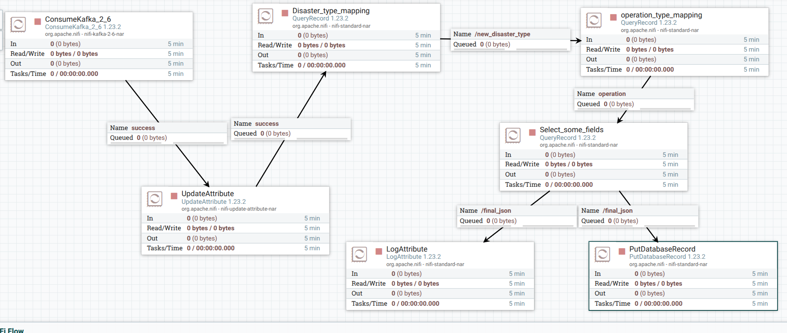
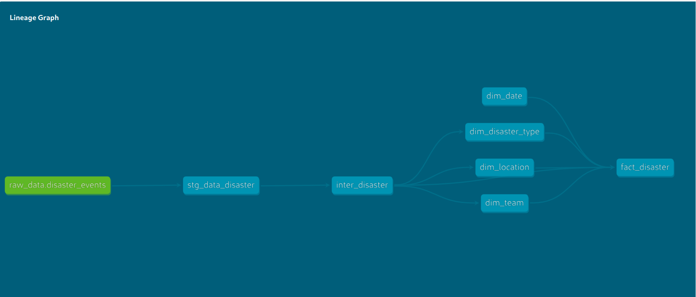
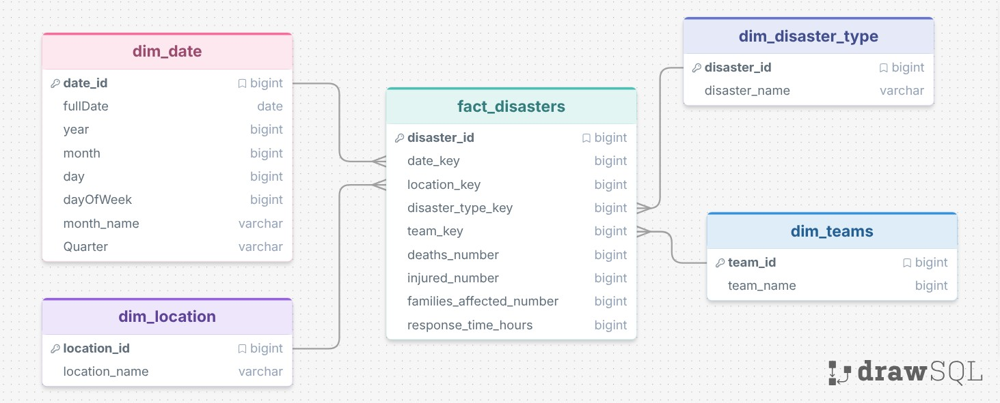
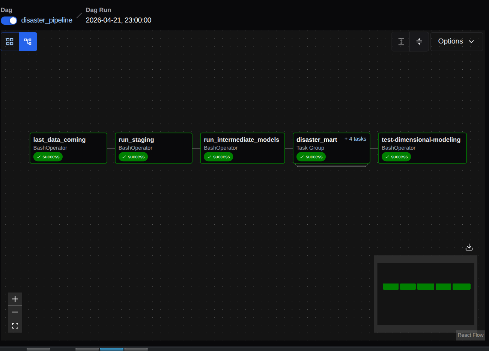
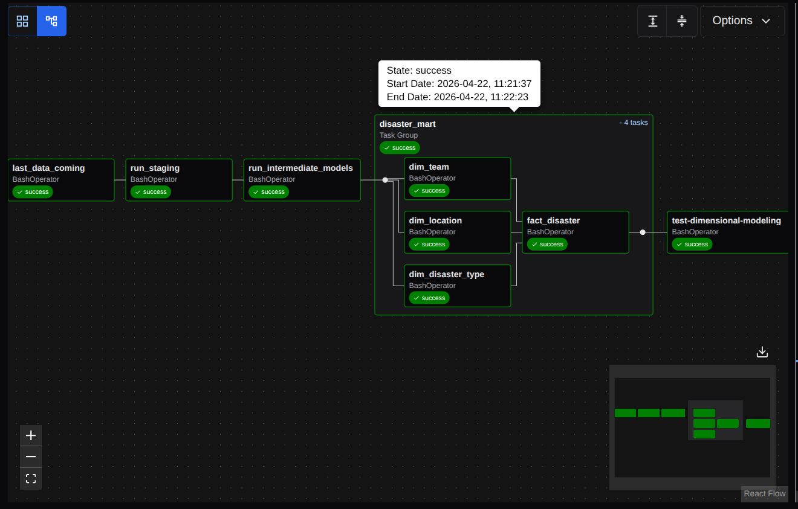

# **Project Overview**
**The Disaster Data Platform is an end-to-end data engineering project designed to collect, process, and analyze disaster-related data to support better decision-making and improve emergency response efficiency.**
**This platform ingests raw disaster data (e.g., type, location, casualties, affected families, response teams, and response time), transforms it into a structured data warehouse model, and makes it available for analytics and visualization.**

-----------
## **Objectives**
- Track and analyze disaster events across different locations
- Evaluate response team performance and response times
- Identify high-impact disasters and affected regions
- Enable data-driven insights for emergency planning and resource allocation

---------
## Data dictionary about source
| **Column Name**     | **Description**                                   |
| ------------------- | ------------------------------------------------- |
| disaster_id         | Unique identifier for each disaster event         |
| disaster_type       | Type/category of the disaster (flood, fire..etc)  |
| location            | City where the disaster occurred                  |
| deaths              | Number of people who died                         |
| injured             | Number of people injured                          |
| families_affected   | Number of families impacted by the disaster       |
| response_team       | Name of the response team assigned                |
| response_time_hours | Time taken by the response team (in hours)        |
| year                | Year when the disaster occurred                   |
| month               | Month of the disaster (1–12)                      |
| day                 | Day of the month                                  |
----------
## <div>**Data platform**</div>


----------
## <div>**Simple Transformation using Nifi**</div>
- Converting the disaster_type abbreviations to meaningful values
- Converting the abbreviated Operation names coming from CDC into full names

 
---------
## <div>**Intensive Transformation using DBT**</div>
  - Incremental loading strategy
  - Star schema design
  - Data quality checks, such as referential integrity
  - Macros to improve reusability and maintainability
------------
## <div>**Data Lineage**</div>
  - 
 
## <div>**Data modeling (Star_Schema)**</div>
 

------------
## <div>**Workflow scheduling using Airflow**</div>
 
 
 
 -------------------------
## <div>**How to Run**</div>
**First of All, you must install docker for running containers**

**1) Clone the repository**
```
git clone https://github.com/AssemSaber/DisasterStream_Analytics.git
```
**2) open Command line interface (CLI) to run Bash script** 
```
./startApp
```
- **3) access the mysql container**

```
     docker exec -it mysql mysql -u Assem -p123456789
```
- **4) Run that command to grant Kafka Connect the necessary permissions**

```
GRANT ALL PRIVILEGES ON GP.* TO 'Assem'@'%';
FLUSH PRIVILEGES;
drop table disaster

CREATE TABLE disaster_data (
    disaster_id INT PRIMARY KEY,
    disaster_type INT,
    location VARCHAR(100),
    deaths INT,
    injured INT,
    families_affected INT,
    response_team VARCHAR(50),
    response_time_hours FLOAT,
    year INT,
    month INT,
    day INT
);
```

 
- #### **5) You need to set up MySQL Connect to run that script, which allows you to import large amounts of data into MySQL**

```
  pip install mysql-connector-python
```

- **6 )Run that in order to import any number of rows as they come as a stream from the source.**
```
 python3 sparkJops/import_mysql.py
```

| Service            | URL                                            |
| ------------------ | ---------------------------------------------- |
| Airflow API Server | [http://localhost:8080](http://localhost:8080) |
| Kafka UI           | [http://localhost:8085](http://localhost:8085) |
| NiFi               | [http://localhost:8086](http://localhost:8086) |
| Grafana            | [http://localhost:3000](http://localhost:3000) |
